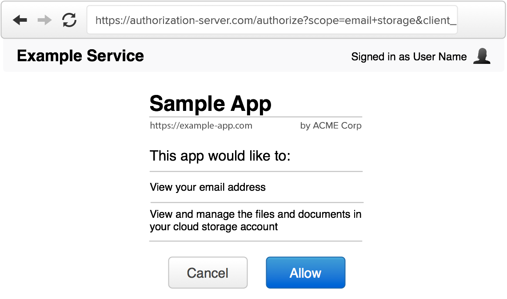
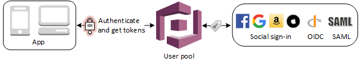

<a href="https://aws.amazon.com/cognito/">
        
</a>

### AWS Cognito

[bluprince13.com/slides/aws-cognito](https://bluprince13.com/slides/aws-cognito)

---

## Let's learn about

- How to authenticate a user in a Cognito user pool
- Authorising users to API Gateway resource based on user pool membership
- Authorising users to API Gateway resource based on user group membership

I will cover the CDK/backand AND frontend.

---

## User pool

--

CDK

--

[Cognito Construct Library](https://docs.aws.amazon.com/cdk/api/v2/docs/aws-cdk-lib.aws_cognito-readme.html)

--

```js
    const userPool = new cognito.UserPool(this, "demo-userpool", {
        userPoolName: "demo-userpool",
        selfSignUpEnabled: true,
        signInAliases: {
            email: true,
        },
        mfa: cognito.Mfa.REQUIRED,
        mfaSecondFactor: {
            sms: false,
            otp: true,
        },
    });

    const userPoolClient = userPool.addClient("demo-client");
```

--

UI

--

[Amplify Auth](https://docs.amplify.aws/lib/auth/getting-started/q/platform/js/#authentication-with-amplify)

--

```js
import { Amplify } from "aws-amplify";
import { withAuthenticator } from "@aws-amplify/ui-react";
import awsconfig from "../src/aws-exports";

Amplify.configure(awsconfig);

import { useState, useEffect } from "react";
import React from "react";

function Home() {
  ...
}

export default withAuthenticator(Home);
```

--

```js
/* eslint-disable */
// WARNING: DO NOT EDIT. This file is automatically generated by AWS Amplify. It will be overwritten.

const awsmobile = {
    "aws_project_region": "us-east-1",
    "aws_cognito_region": "us-east-1",
    "aws_user_pools_id": "us-east-1_G7AS4Kfha",
    "aws_user_pools_web_client_id": "6nqhd8jtr0f90o7vqssjlk69on",
    "oauth": {},
    "aws_cognito_username_attributes": [
        "EMAIL"
    ],
    "aws_cognito_social_providers": [],
    "aws_cognito_signup_attributes": [],
    "aws_cognito_mfa_configuration": "ON",
    "aws_cognito_mfa_types": [
        "TOTP"
    ],
    "aws_cognito_password_protection_settings": {
        "passwordPolicyMinLength": 8,
        "passwordPolicyCharacters": [
            "REQUIRES_LOWERCASE",
            "REQUIRES_UPPERCASE",
            "REQUIRES_NUMBERS",
            "REQUIRES_SYMBOLS"
        ]
    },
    "aws_cognito_verification_mechanisms": [
        "EMAIL"
    ]
};


export default awsmobile;
```

--

Json Web Token

--

[jwt.io](https://jwt.io/)

--

JWT vs Session id

--

 <!-- .element: width="80%" -->

[What Is JWT and Why Should You Use JWT - YouTube](https://www.youtube.com/watch?v=7Q17ubqLfaM)

<!-- .element: class="caption" -->

---

## Authorising users to API Gateway resource based on user pool membership

--

 <!-- .element: width="80%" -->

[Accessing resources with API Gateway and Lambda after sign-in](https://docs.amazonaws.cn/en_us/cognito/latest/developerguide/user-pool-accessing-resources-api-gateway-and-lambda.html)

<!-- .element: class="caption" -->

--

CDK

--

```js
const userPoolAuthorizer = new apigateway.CognitoUserPoolsAuthorizer(
    this,
    "user-pool-authorizer",
    {
        cognitoUserPools: [userPool],
    }
);
const userPoolBased = api.root.addResource("user-pool-based");
userPoolBased.addMethod(
    "GET",
    new apigateway.LambdaIntegration(readLambda),
    { authorizer: userPoolAuthorizer }
);
```

--

UI

--

```js
import { API, Auth } from "aws-amplify";

export async function getData(path) {
    const myInit = {
        headers: {
            Authorization: `Bearer ${(await Auth.currentSession())
                .getIdToken()
                .getJwtToken()}`,
        },
    };

    return API.get(apiName, path, myInit);
}
```

---

## Authorising users to API Gateway resource based on user group membership

--

 <!-- .element: width="80%" -->

[Building fine-grained authorization using Amazon Cognito User Pools groups](https://aws.amazon.com/blogs/mobile/building-fine-grained-authorization-using-amazon-cognito-user-pools-groups/)

<!-- .element: class="caption" -->

--

CDK

--

```js
const readRole = new iam.Role(this, "read-role", {
    assumedBy: new iam.FederatedPrincipal(
        "cognito-identity.amazonaws.com",
        {
            StringEquals: {
                "cognito-identity.amazonaws.com:aud": identityPool.ref,
            },
            "ForAnyValue:StringLike": {
                "cognito-identity.amazonaws.com:amr": "authenticated",
            },
        },
        "sts:AssumeRoleWithWebIdentity"
    ),
});

const writeRole = new iam.Role(this, "write-role", {
...
```

--

```js
const readerGroup = new cognito.CfnUserPoolGroup(this, "readerGroup", {
    userPoolId: userPool.userPoolId,
    groupName: "reader",
    precedence: 2,
    roleArn: readRole.roleArn,
});

const writerGroup = new cognito.CfnUserPoolGroup(this, "writerGroup", {
    userPoolId: userPool.userPoolId,
    groupName: "writer",
    precedence: 1,
    roleArn: writeRole.roleArn,
});
```

--

```js
new cognito.CfnIdentityPoolRoleAttachment(
    this,
    "identity-pool-role-attachment",
    {
        identityPoolId: identityPool.ref,
        roles: {},
        roleMappings: {
            mapping: {
                type: "Token",
                ambiguousRoleResolution: "Deny",
                identityProvider: `cognito-idp.${
                    Stack.of(this).region
                }.amazonaws.com/${userPool.userPoolId}:${
                    userPoolClient.userPoolClientId
                }`,
            },
        },
    }
);
```

--

UI

--

```js
async function getCredentialsForIdentityPool() {
    // https://docs.aws.amazon.com/cognito/latest/developerguide/amazon-cognito-integrating-user-pools-with-identity-pools.html
    const credentialsProvider = fromCognitoIdentityPool({
        identityPoolId,
        logins: {
            [`cognito-idp.${region}.amazonaws.com/${userPoolId}`]: (
                await Auth.currentSession()
            )
                .getIdToken()
                .getJwtToken(),
        },
        clientConfig: { region },
    });
    const credentials = await credentialsProvider();
    console.log(credentials);
    const interceptor = aws4Interceptor(
        {
            region,
            service: "execute-api",
        },
        credentials
    );
    axios.interceptors.request.use(interceptor);
}
```

--

```js
...
const request = {
      method: 'GET',
      url: 'https://vh1ds00pvd.execute-api.us-east-1.amazonaws.com/prod/user-group-based',
      data: ''
};
const accessInfo = {
    access_key: credentials.accessKeyId,
    secret_key: credentials.secretAccessKey,
    session_token: credentials.sessionToken,
};
const serviceInfo = {
    service: 'execute-api',
    region: 'us-east-1'
}
const signedRequest = Signer.sign(request, accessInfo, serviceInfo);
...
```

--

Adding users to a group automatically on sign up

--

CDK

--

```js
userPool.addTrigger(
    cognito.UserPoolOperation.POST_CONFIRMATION,
    postConfirmationLambda
);
```

--

```js
const {
    CognitoIdentityProviderClient,
    AdminAddUserToGroupCommand,
} = require("@aws-sdk/client-cognito-identity-provider");

const client = new CognitoIdentityProviderClient({});

exports.addUserToReaderGroup = async function (event, context) {
    const { userPoolId, userName } = event;

    const command = new AdminAddUserToGroupCommand({
        UserPoolId: userPoolId,
        Username: userName,
        GroupName: "reader",
    });

    await client.send(command);
    context.succeed(event);
};
```

---

## Custom lambda authoriser

--

 <!-- .element: width="80%" -->

[Building fine-grained authorization using Amazon Cognito, API Gateway, and IAM](https://aws.amazon.com/blogs/security/building-fine-grained-authorization-using-amazon-cognito-api-gateway-and-iam/)

<!-- .element: class="caption" -->

---

## OAuth Scopes

--

 <!-- .element: width="80%" -->

[OAuth2 done right](https://leastprivilege.com/2013/06/12/oauth2-done-right/)

<!-- .element: class="caption" -->

--

 <!-- .element: width="80%" -->

[The Authorization Interface](https://www.oauth.com/oauth2-servers/authorization/the-authorization-interface/)

<!-- .element: class="caption" -->

--

[How do I authorize access to API Gateway APIs using custom scopes in Amazon Cognito?](https://aws.amazon.com/premiumsupport/knowledge-center/cognito-custom-scopes-api-gateway/#)

---

## Add claims dynamically

--

 <!-- .element: width="80%" -->

[Use Amazon Cognito to add claims to an identity token for fine-grained authorization](https://aws.amazon.com/blogs/security/use-amazon-cognito-to-add-claims-to-an-identity-token-for-fine-grained-authorization/)

<!-- .element: class="caption" -->

Uses [pre-token generation
trigger](https://docs.aws.amazon.com/cognito/latest/developerguide/user-pool-lambda-pre-token-generation.html#user-pool-lambda-pre-token-generation-trigger-source)

---

## Identity Federation

 <!-- .element: width="80%" -->

[Adding user pool sign-in through a third party
](https://docs.aws.amazon.com/cognito/latest/developerguide/cognito-user-pools-identity-federation.html)

---

## References

- [Introduction to Amazon Cognito at acloud.guru](https://learn.acloud.guru/course/introduction-to-amazon-cognito/learn/4efa7600-73bd-409e-8dc9-45b4486e27e7/a8df8e1b-93e7-4d20-8cf9-783377d12a79/watch)
- [Evaluating access control methods to secure Amazon API Gateway APIs
](https://aws.amazon.com/blogs/compute/evaluating-access-control-methods-to-secure-amazon-api-gateway-apis/)
- [Fine-grained Access Control with Amazon Cognito Identity Pools - YouTube](https://www.youtube.com/watch?v=tAUmz94O2Qo)