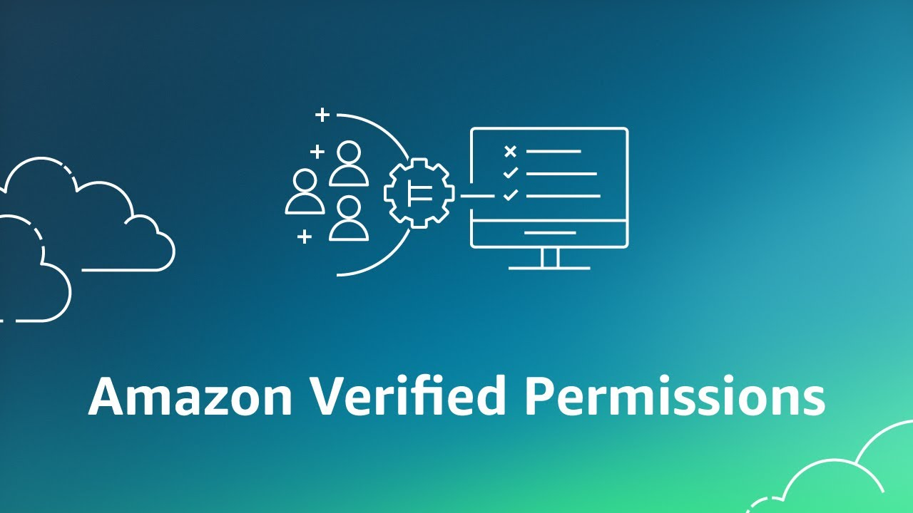

<a href="https://revealjs.com">
        
</a>

### AWS Verified Permissions

[bluprince13.com/slides/aws-verified-permissions](https://bluprince13.com/slides/aws-verified-permissions)

---

## Let's learn about

- Authorisation (AuthZ)
- Cedar policy language
- AWS Verified Permissions
- Demo using notestapp

---

## Authorization is the process of giving someone the ability to access a resource

[Auth0](https://auth0.com/intro-to-iam/what-is-authorization)

<!-- .element: class="caption" -->

--

Usually, custom approaches are used relying on a database to store authz data

--

## Coarse-Grained vs. Fine-Grained Access Control

- CGA
  - Based on a single factor, e.g., user role
  - Large groups of users, e.g., readers, writers, admin
  - Broad actions, e.g., read
  - Large groups of resources, e.g., entire website
- FGA
  - Based on multiple factors, e.g. role, team, location
  - Could even be unique permission per user/resource, e.g. user can access their photos, and who it's shared with
  - Finer actions, e.g., listFolder, viewFile

--

## Why would we want to use a managed service?

- Development speed: No need to re-invent the wheel, we can focus on developing the application
- Scalability - autoscaling managed service
- No operational load 🤞🏾

--

## Drawbacks

- Learning curve
- Vendor lock-in
- Additional latency
- New service risk - (AVP released in 2023)
- Maybe limitations on customisation

---

## Cedar policy language

--

Verified Permissions uses the Cedar policy language to define fine-grained permissions

--

Cedar Tutorial - https://www.cedarpolicy.com/en/tutorial

--

Policy = Effect (permit/forbid) + Scope (principal, action, resource)


```
permit(
  principal == User::"alice",
  action    == Action::"update",
  resource  == Photo::"VacationPhoto94.jpg"
);
```

--

### Principals and resources are identified by a type and an ID.

e.g User::"alice" =>  A principal of type ‘User’ called ‘Alice’.

--

## Denied by default if there is no applicable permit policy

--

## Sets

```
permit(
  principal == User::"alice",
  action in [Action::"view", Action::"edit", Action::"delete"],
  resource == Photo::"VacationPhoto94.jpg"
);
```

--

## Undefined scope = *

```
permit(
  principal,
  action in [Action::"view", Action::"edit", Action::"delete"],
  resource == Photo::"vacationPhoto.jpg"
);
```

--

## Groups for role-based access control [RBAC]

```
permit(
  principal in Role::"vacationPhotoJudges",
  action == Action::"view",
  resource == Photo::"vacationPhoto94.jpg"
);
```

--

## Entities info passed in request defines 'parents'

```
[
    {
        "uid": {
            "type": "User",
            "id": "Bob"
        },
        "attrs": {},
        "parents": [
            {
                "type": "Role",
                "id": "vacationPhotoJudges"
            },
            {
                "type": "Role",
                "id": "juniorPhotographerJudges"
            }
        ]
    },
    {
        "uid": {
            "type": "Role",
            "id": "vacationPhotoJudges"
        },
        "attrs": {},
        "parents": []
    },
    {
        "uid": {
            "type": "Role",
            "id": "juniorPhotographerJudges"
        },
        "attrs": {},
        "parents": []
    }
]
```

--

## Attribute-based access control

```
permit(
  principal,
  action == Action::"view",
  resource
)
when {resource.accessLevel == "public" && principal.location == "USA"};
```

--

## Entities info passed in request defines 'attrs'

```
[
    {
        "uid": {
            "type": "Photo",
            "id": "VacationPhoto94.jpg"
        },
        "attrs": {
            "accessLevel": "public"
        },
        "parents": []
    },
    {
        "uid": {
            "type": "User",
            "id": "alice"
        },
        "attrs": {
            "location": "USA"
        },
        "parents": []
    }
]
```

--

```
permit(
  principal,
  action in [Action::"view", Action::"edit", Action::"delete"],
  resource
)
when {
  resource.owner == principal.id
};
```

--

## Relationship Based Access Control [ReBAC]

- Relationship b/w principal and resource (e.g. viewer, collaborator)
- Stored outside outside of policy store
- Uses attribute on resource to model relationship.
- https://docs.cedarpolicy.com/overview/patterns.html#relationship

--

```
permit (
  principal is User,
  action in Action::"contributorActions",
  resource is List)
when {
  principal in resource.contributingUsers
};
```

--

## Discretionary permissions

- Ad-hoc basis e.g. at the discretion of an admin
- Specific to an individual principal, e.g. `User::Alice`
- https://docs.cedarpolicy.com/overview/patterns.html#discretionary

--

- Can also create policies programatically

```
permit (
    principal == User::"973db890-092c-49e4-a9d0-912a4c0a20c7", // "Alice"
    action in [Action::"readFile", Action::"writeFile"],
    resource in Folder::"4e153865-0b24-4b77-94f7-9a7f24fa8a59"   // "Vacation Photos"
);
```

--

## Policy template

```
permit(
    principal == ?principal,
    action in [Action::"readFile", Action::"writeFile"]
    resource  == ?resource
  );
```

https://www.cedarpolicy.com/en/tutorial/policy-templates

--

## Use attribute or templates to represent relationships?

- ABAC only if the relation is stored in application database for other reasons than permissions management
- Otherwise, template-based relationships are appropriate
- See https://docs.cedarpolicy.com/bestpractices/bp-relationship-representation.html

--

## Context

```
permit(
    principal in User::"alice",
    action in [Action::"update", Action::"delete"],
    resource == Photo::"flower.jpg")
when {
    context.mfa_authenticated == true &&
    context.request_client_ip == "222.222.222.222"
};
```

--

## Schema (optional, recommended)

A schema is a formal declaration of the names and structure of your entity types. You declare the name of each type of principal, resource, and action that your application supports.

Benefits: 
- Policy validations against schema by Verified Permissions
- Define action groups. e.g. Read = [readFile, listFolder...]

Example: https://www.cedarpolicy.com/en/tutorial/schema

---

## AWS Verified Permissions

--

## Integrations

- Cognito - Principals/Groups could be from a Cognito user pool
- API Gateway  - Actions/resources linked to APIs

--

## Test Bench

AWS console UI to test Authorize requests manually

--

## Missing features

--

## List Principal/Resources APIs

--

## Local evaluation

- https://aws.amazon.com/blogs/opensource/easier-cedar-policy-management/
- https://github.com/awslabs/avp-local-agent - Rust crate/package - experimental

--

## Backup/recovery