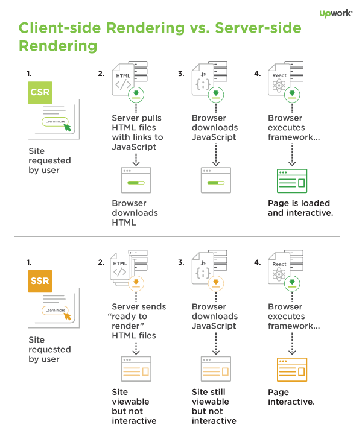

<a href="https://revealjs.com">
        
</a>

### Introduction to Next.js

[bluprince13.com/slides/intro-to-nextjs](https://bluprince13.com/slides/intro-to-nextjs)

---

## Let's learn about

- What is Next.js
- Page-based routing system
- SSG and SSR
- API routes
- Deployment

---

## What is Next.js

- React.js framework -> make it easier to develop React apps
- [React docs](https://reactjs.org/docs/create-a-new-react-app.html#recommended-toolchains)
  recommends Next.js for building a server-rendered website with Node.js

--

## Cool features

- An intuitive page-based routing system
- **SSR and SSG** - Hybrid rendering
- API routes to build API endpoints with Serverless Functions
- Typescript support
- Rewrites and redirects - great for incremental adoption

---

### Page-based routing system

--

mywebsite.com/about

```js
// pages/about.js
function About() {
 return <div>About</div>
}

export default About
```

--

mywebsite.com/post/1

```js
// pages/post/[pid].js
import { useRouter } from 'next/router'

const Post = () => {
 const router = useRouter()
 const { pid } = router.query

 return <p>Post: {pid}</p>
}

export default Post
```

--

- Each generated HTML is associated with minimal JavaScript code necessary for
  that page.
- When a page is loaded by the browser, its JavaScript code runs and makes the
  page fully interactive - hydration
- Any `<Link />` that is in the viewport (initially or through scroll) will be
  preloaded - prefetching

---

### SSG and SSR

--

### Benefits of pre-rendering vs client side rendering

- Better performance
- SEO

--

### Static Site Generator [SSG]

 <!-- .element: width="80%" -->

[Netlify](https://cdn.netlify.com/b0cd7be20ba718c92b5da007a109a89122f6791a/7824d/img/blog/ssg-host-flow.png)

<!-- .element: class="caption" -->

--

```js
function Blog({ posts }) {
 // Render posts...
}

// This function gets called at build time
export async function getStaticProps() {
 // Call an external API endpoint to get posts
 const res = await fetch('https://.../posts')
 const posts = await res.json()

 // By returning { props: { posts } }, the Blog component
 // will receive `posts` as a prop at build time
 return {
  props: {
   posts
  }
 }
}

export default Blog
```

--

### Server Side Rendering [SSR]

 <!-- .element: width="50%" -->

[Upwork](https://content-static.upwork.com/blog/uploads/sites/3/2017/09/11114835/CSR-v-SSR-infographic.png)

<!-- .element: class="caption" -->

--

```js
function Page({ data }) {
 // Render data...
}

// This gets called on every request
export async function getServerSideProps() {
 // Fetch data from external API
 const res = await fetch(`https://.../data`)
 const data = await res.json()

 // Pass data to the page via props
 return { props: { data } }
}

export default Page
```

--

- Static Site Generation

  - Can I pre-render this page ahead of a user's request?
  - e.g. About us page, blog posts, documentation.
  - Can also use Client-side Rendering to bring in additional data.

- Server Side Rendering
  - For frequently updated data from an external API
  - e.g. latest Trump tweets

---

### API routes

```js
// pages/api/user.js
export default function handler(req, res) {
 res.status(200).json({ name: 'John Doe' })
}
```

---

### Deployment

- [Vercel platform](https://vercel.com/) - Easiest option
- Link your Github repo with Vercel for Continous Deployment
- Develop, Preview, and Ship
- Optimized for Next.js
  - Static assets served from Edge network
  - SSR pages and API routes -> Serverless Functions which scales infinitely

--

### Other options

- [AWS Amplify](https://docs.amplify.aws/guides/hosting/nextjs/q/platform/js#adding-amplify-hosting-1)
- [serverless-next.js](https://github.com/serverless-nextjs/serverless-next.js)

> A zero configuration Next.js 9/10 serverless component for AWS Lambda@Edge
> aiming for full feature parity.

---

```bash
yarn create next-app
```
