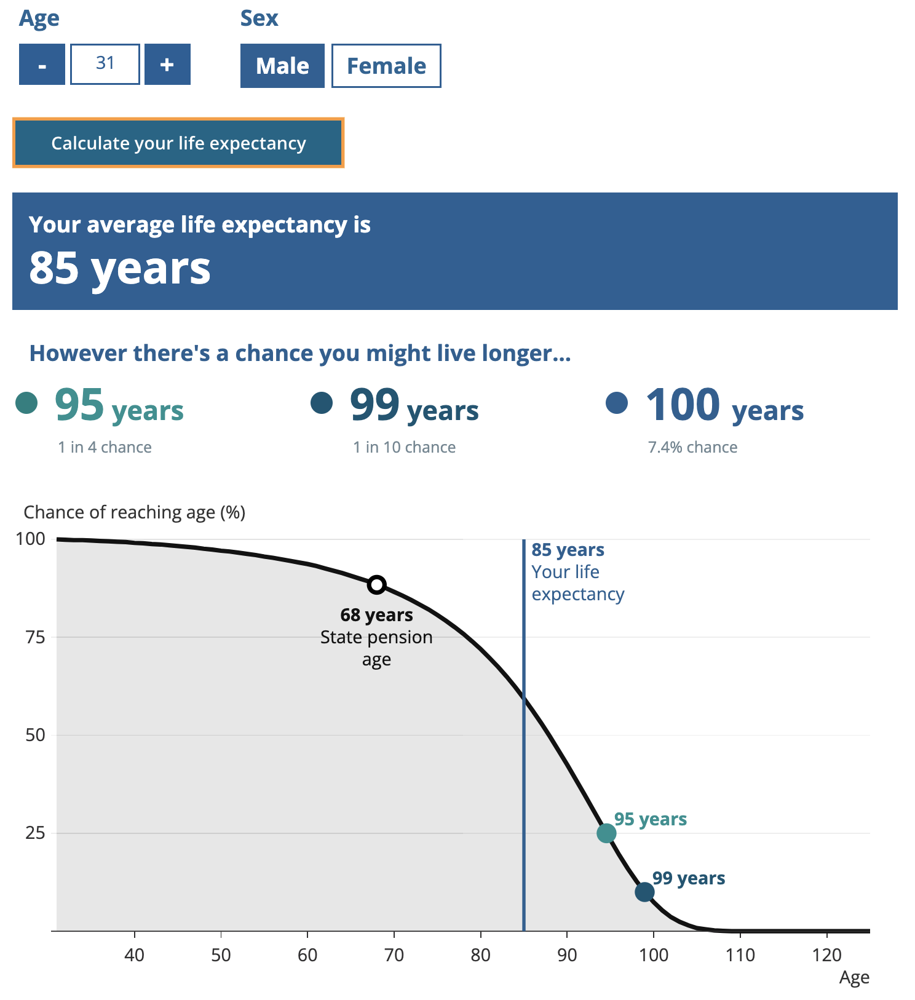
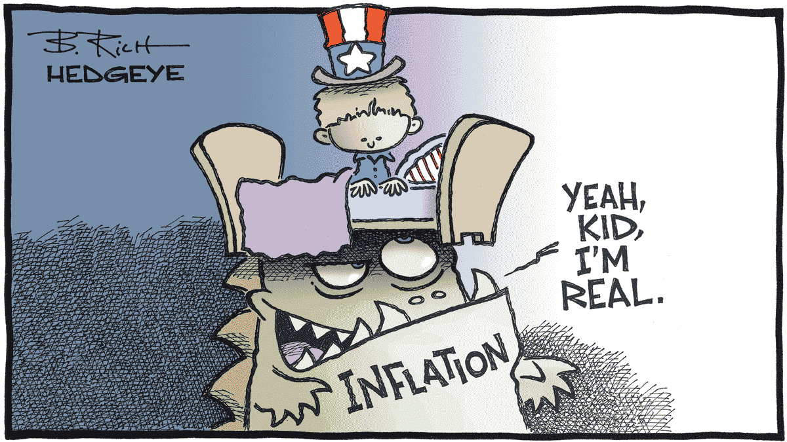
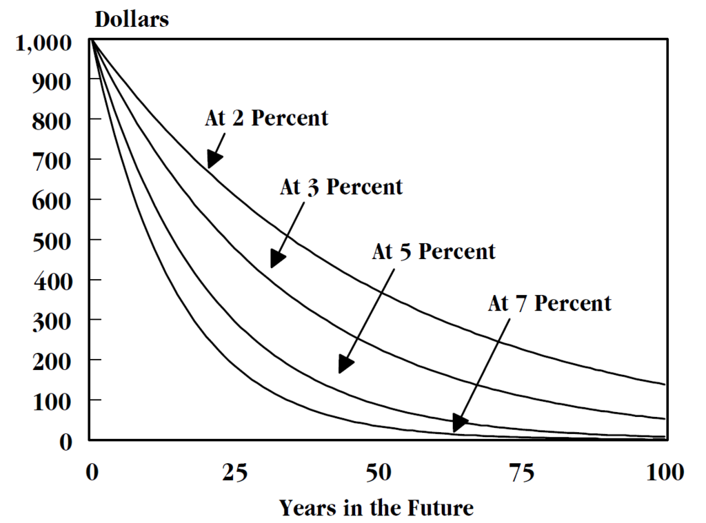
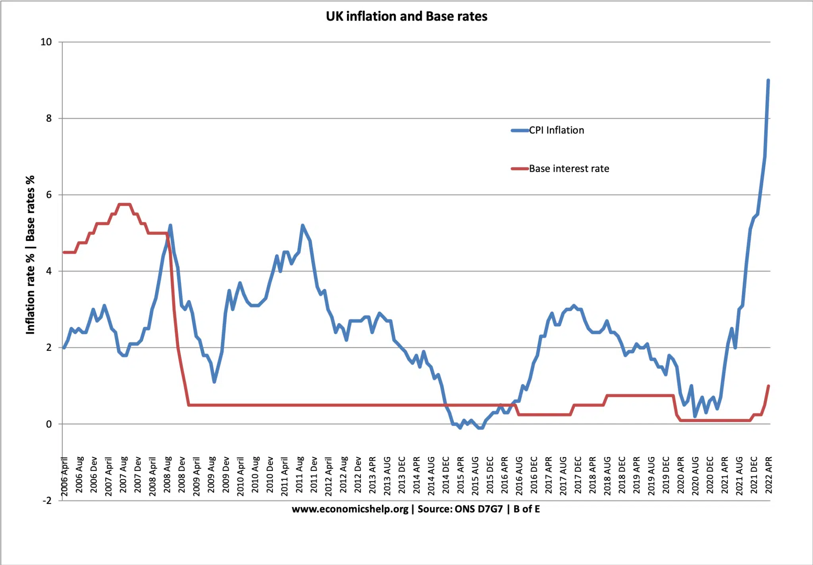
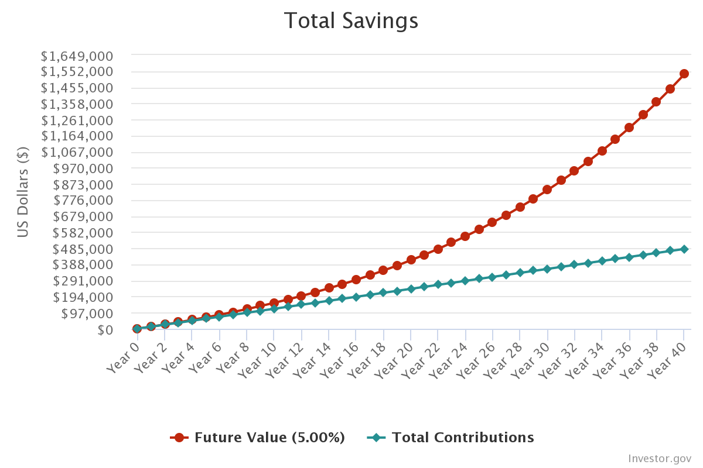
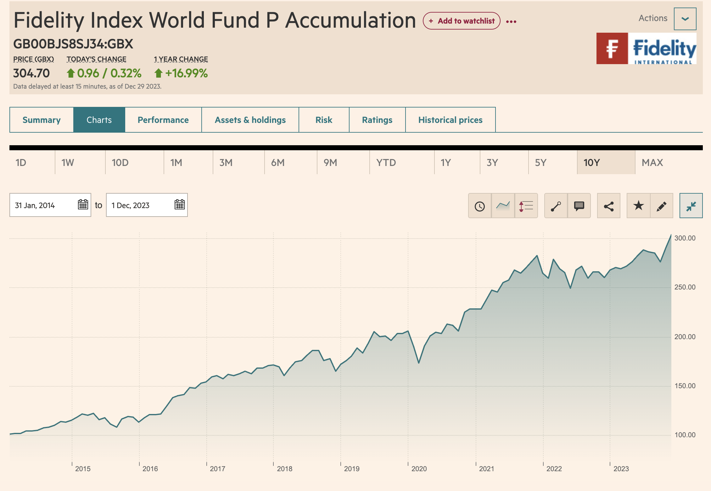
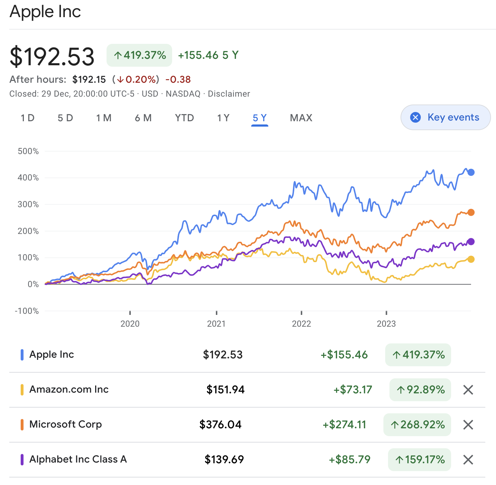
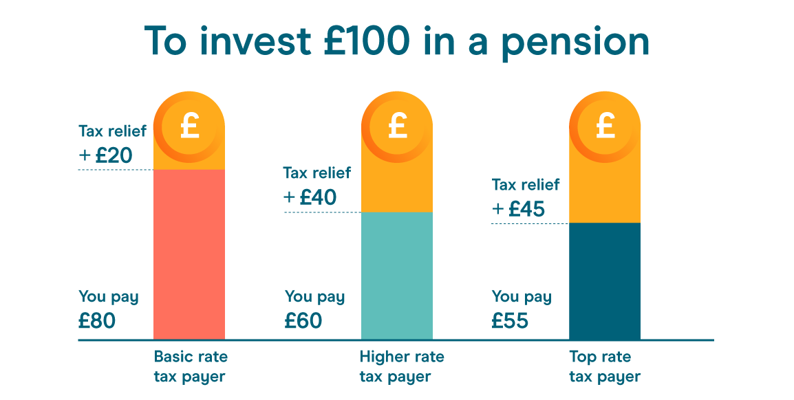
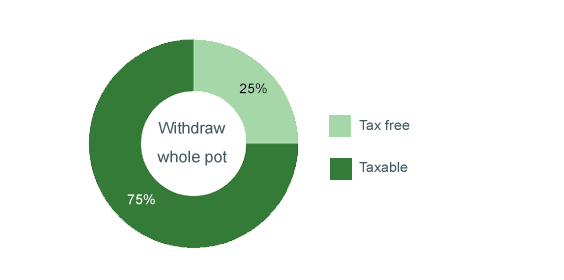

### Introduction to investing

[bluprince13.com/slides/intro-to-stock-market](https://bluprince13.com/slides/intro-to-stock-market)

---

## Motivation

My partner wanted me to give her an introuction to the stock market that was
simple, immediately useful and most of all, not boring.

---

## Agenda

- Why invest?
  - Retirement
  - Inflation
  - Compounding
- Assets: Stocks vs. funds
- Accounts: Pensions vs. ISA vs. GIA
- Platforms
- How to learn more

--

## Out of scope but important

- Debt
- Mortgages
- Credit score
- Budgeting
- Insurance
- Wills
- Bonds

--

## This is not an in-depth guide

Aim is only to inspire you to take personal finance
seriously and do your own research.

Some of my own understanding may be flawed!

--

## This is not a get rich quick thing, it's a get rich slow thing

  <!-- .element: width="40%" -->

--

## I am not a financial advisor

---

## Why invest (in the stock market)?

--

## Common ways to grow wealth

- Income
- Invest your existing wealth

Note:

- The first option costs time that you might otherwise spend with your family
  and friends or do something you enjoy.
- The second option requires you to accept a risk, but you could make money
  in your sleep.

--

## Retirement

- You cannot earn an income forever.
- There's a risk that you might live a long time after you retire.

--

 <!-- .element: width="55%" -->

[Life expectancy calculator - Office for National Statistics, UK](https://www.ons.gov.uk/peoplepopulationandcommunity/healthandsocialcare/healthandlifeexpectancies/articles/lifeexpectancycalculator/2019-06-07)

<!-- .element: class="caption" -->

--

Inflation

 <!-- .element: width="55%" -->

[By Bob Rich, Hedgeye](https://app.hedgeye.com/insights/119268-9-1-11-inflation-cartoons-capturing-the-insanity?type=macro)

--

> We set monetary policy to achieve the Government's target of keeping inflation at 2%.

[Monetary policy | Bank of England](https://www.bankofengland.co.uk/monetary-policy)

--

> the average between 1989 and April 2022 was 2.5%.

[Consumer price inflation, historical estimates and recent trends, UK: 1950 to 2022](https://www.ons.gov.uk/economy/inflationandpriceindices/articles/consumerpriceinflationhistoricalestimatesandrecenttrendsuk/1950to2022)

--

 <!-- .element: width="80%" -->

[Time value of money](https://www.wikiwand.com/en/Time_value_of_money)

<!-- .element: class="caption" -->

--

 <!-- .element: width="60%" -->

[The Bank of England building - Wikipedia](https://www.wikiwand.com/en/Bank_of_England)

--

 <!-- .element: width="80%" -->

[Effect of higher interest rates and lower taxes on living standards - Economics Help](https://www.economicshelp.org/blog/168751/economics/effect-of-higher-interest-rates-and-lower-taxes-on-living-standards/)

<!-- .element: class="caption" -->
--

> inflation and cash savings rates tend to move in broad correlation. There will be times when accounts pay more than inflation and times when they pay less, but extended periods when rates beat inflation are unlikely.

[Will my cash savings beat inflation? - Fidelity](https://www.fidelity.co.uk/markets-insights/investing-ideas/capital-preservation/will-my-cash-savings-beat-inflation/)

<!-- .element: class="caption" -->

--

Cash is NOT an investment. Cash is for spending, that's all.

[meaningfulmoney: Only Hold the Cash You Need](https://meaningfulmoney.tv/2022/04/04/the-ultimate-guide-to-investing-part-2-only-hold-the-cash-you-need/)

<!-- .element: class="caption" -->

--

What if you could beat inflation?

--

<html>
<iframe src="https://e.infogram.com/_/36nJA9DHmfB7J5sUyIGM?src=embed" title="Compound Interest Graph B" width="620" height="620" scrolling="no" frameborder="0" style="border:none;" allowfullscreen="allowfullscreen"></iframe>
</html>

--

## Compounding: when an investment generates earnings or dividends which are then reinvested

Note:

- This also implies that it's lot better to invest when you're young than when
  you're old.

--

 <!-- .element: width="80%" -->

Investing just $1000 a month could allow you become a millionaire within 40
years.
[[Compound Interest Calculator](https://www.investor.gov/financial-tools-calculators/calculators/compound-interest-calculator)]

<!-- .element: class="caption" -->

--

 <!-- .element: width="85%" -->

[Fidelity Index World Fund P Accumulation - Financial Times](https://markets.ft.com/data/funds/tearsheet/charts?s=GB00BJS8SJ34:GBX)

<!-- .element: class="caption" -->

--

## Tripled in 10 years

Equivalent to Compound Annual Growth Rate [CAGR] of 11.6%

--

## The stock market is volatile though

> time in the market beats timing the market

The fluctuations don't matter as much if you are investing for a long time.

--

## Summary

- Cash is NOT an investment. Cash is for spending.
- The stock market offers better returns than cash at higher risk.
- The risk is mitigated by diversification and time in the market.

---

# Assets: Stocks vs. funds

--

## Stocks

--

> Shares of stock let investors participate in the company’s success via
> increases in the stock’s price and through dividends.

--

 <!-- .element: width="60%" -->

[Google Finance](https://www.google.com/finance/quote/AAPL:NASDAQ?sa=X&ved=2ahUKEwi--P-aw7yDAxUuXUEAHSxDAjkQ3ecFegQISBAf&window=5Y&comparison=NASDAQ:AMZN,NASDAQ:MSFT,NASDAQ:GOOGL)

<!-- .element: class="caption" -->

--

## Individual stocks are risky

--

## Solution: Diversify using funds

--

## Funds also offer convenience

- No need to manually buy individual stocks or rebalance their ratios over time
- More efficient for funds to buy stocks in a different currency
- `Accumulation` funds auto re-invest dividends

--

## Passive vs. Active funds

- Passive
  - Aims to replicate a given index
  - e.g. [Fidelity Index World
    Fund](https://www.fidelity.co.uk/factsheet-data/factsheet/GB00BJS8SJ34-fidelity-index-world-fund-p-acc/key-statistics)
    follows the [MSCI World Index](https://www.msci.com/our-solutions/indexes/developed-markets).

- Active
  - Aims to outperform the returns of a specific benchmark
  - Typically more expensive
  - e.g. [Fundsmith Equity](https://www.fidelity.co.uk/factsheet-data/factsheet/GB00B41YBW71-fundsmith-equity-fund-i-class-acc/key-statistics)

---

## Types of accounts

--

## Pension

--

## Defined Contribution Pension - most common type

--

Total investment =  
Employee contribution +  
Employer contribution (minimum 3%)

[Employer pension contributions and funding](https://www.thepensionsregulator.gov.uk/en/employers/managing-a-scheme/contributions-and-funding)

<!-- .element: class="caption" -->

--

## Employee contribution not taxed

 <!-- .element: width="60%" -->

[What is pension tax relief? - moneybox](https://www.moneyboxapp.com/learn/pensions/academy/what-is-pension-tax-relief/)

<!-- .element: class="caption" -->

--

## Pension tax is `deferred`

 <!-- .element: width="60%" -->

[Taking tax free cash from a pension fund -
AJBell](https://www.ajbell.co.uk/pensions-and-retirement/accessing-your-pension/tax-free-cash)

<!-- .element: class="caption" -->

--

## Pension annual allowance

£60,000

[Tax on your private pension contributions - gov.uk](https://www.gov.uk/tax-on-your-private-pension/annual-allowance)

<!-- .element: class="caption" -->

--

## Pension withrdrawal age

55 (rising to 57 from 2028)

[When can I withdraw money from my pension?](https://www.hl.co.uk/pensions/insights/when-can-i-withdraw-money-from-my-pension)

--

## Individual Savings Account [ISA]

--

## ISA annual allowance

£20,000

[Individual Savings Accounts (ISAs) - gov.uk](https://www.gov.uk/individual-savings-accounts/how-isas-work)

<!-- .element: class="caption" -->

--

## Types

- Stocks and shares ISAs
- Cash ISAs

--

## Enough to cover savings goals

- ISA
  - £20,000 per year
  - Pre-retirement needs
- Pension
  - £60,000 per year
  - Post-retirement needs

--

## General Investment Account [GIA]

Taxed!

- Dividends
  - Above £1000
  - [[Tax on dividends - gov.uk](https://www.gov.uk/tax-on-dividends)]
- Gains
  - Above £6000
  - [[Capital Gains Tax allowances - gov.uk](https://www.gov.uk/capital-gains-tax/allowances)]

---

## Platforms / brokers

Websites that allow users to open ISA / GIA

See [Broker comparison: cheap investment platforms UK -
Monevator](https://monevator.com/compare-uk-cheapest-online-brokers/)

--

- Start with a percentage-fee broker
  - [Charles Stanley Direct](https://www.charles-stanley.co.uk/about-us/important-information/investment-management-services/direct-charges)
  - 0.35%/year
- Otherwise, use a flat-fee broker
  - [Interactive Investor](https://www.ii.co.uk/our-charges)
  - £11.99/month

--

As easy as opening a bank account. Don't feel intimidated.

---

## Where to start?

1. Check/update your pension contribution percentage
2. Check/update what fund your pension is getting invested into
3. Make sure you have an emergency fund (at least 3 months salary) in an easy
   access bank account
4. Open an ISA with a platform/broker
5. Set up a monthly direct debit and automatic investment in your ISA
6. Keep track of your finances and increase ISA/Pension contributions over time

---

## How to learn more

--

- Reminder that I have not told you everything you need to know.
- Do your own research.

--

But, don't wait to become an expert. Best way to learn is by doing.

--

- [MoneySavingExpert](https://www.moneysavingexpert.com/)
  - [Weekly email](https://www.moneysavingexpert.com/latesttip/)
  - [Martin Lewis Podcast](https://www.moneysavingexpert.com/site/listen-to--the-martin-lewis-podcast-/)
-[MeaningfulMoney](meaningfulmoney.tv)
  - [YouTube](https://www.youtube.com/@MeaningfulMoney/videos)
  - [Podcast](https://meaningfulmoney.tv/mmpodcast/)
    - [S18 – Ultimate Guides](https://meaningfulmoney.tv/season-18-ultimate-guides/)
- [PensionCraft](https://www.youtube.com/@Pensioncraft)
  - [Invest now or wait](https://www.youtube.com/watch?v=dUU8ZY9G-Ng)
  - [Top Stocks Are Tough To Find](https://www.youtube.com/watch?v=xQvTJG7DSR8)
  - [Best Index Funds for Global Stocks](https://www.youtube.com/watch?v=8qLgw4FS6wI)

--

[r/UKPersonalFinance](https://www.reddit.com/r/UKPersonalFinance/)

--

Talk to finance savvy friends/family. Do not treat finance as a taboo topic!
