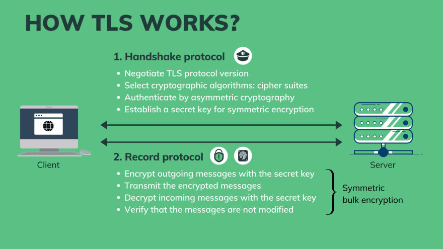

### Introduction to HTTPS and certificate management

<!-- [bluprince13.com/slides/introduction-to-https-and-cert-management](https://bluprince13.com/slides/introduction-to-https-and-cert-management) -->

---

## Let's learn about

- How HTTPS works
- How certificates work
- Certificate managers

---

# How HTTPS works

--

 <!-- .element: width="80%" -->

[thesslstore](https://www.thesslstore.com/blog/how-does-https-work/)

<!-- .element: class="caption" -->

Note:

- For example, a malicious actor could somehow give you the wrong IP address for
  a website.

--

 <!-- .element: width="80%" -->

[Tech School](https://dev.to/techschoolguru/a-complete-overview-of-ssl-tls-and-its-cryptographic-system-36pd)

<!-- .element: class="caption" -->

--

 <!-- .element: width="80%" -->

[thesslstore](https://www.thesslstore.com/blog/symmetric-encryption-101-definition-how-it-works-when-its-used/)

<!-- .element: class="caption" -->

--

 <!-- .element: width="80%" -->

[thesslstore](https://www.thesslstore.com/blog/asymmetric-vs-symmetric-encryption/)

<!-- .element: class="caption" -->

--

 <!-- .element: width="80%" -->

[Tech School](https://dev.to/techschoolguru/a-complete-overview-of-ssl-tls-and-its-cryptographic-system-36pd)

<!-- .element: class="caption" -->

--

# Who sent us the public key?

---

# How certificates work

--

 <!-- .element: width="80%" -->

[Tech School](https://dev.to/techschoolguru/a-complete-overview-of-ssl-tls-and-its-cryptographic-system-36pd)

<!-- .element: class="caption" -->

--

 <!-- .element: width="80%" -->

[Tech School](https://dev.to/techschoolguru/a-complete-overview-of-ssl-tls-and-its-cryptographic-system-36pd)

<!-- .element: class="caption" -->

--

 <!-- .element: width="80%" -->

[Tech School](https://dev.to/techschoolguru/a-complete-overview-of-ssl-tls-and-its-cryptographic-system-36pd)

<!-- .element: class="caption" -->

---

# Amazon Certificate Manager (ACM)

https://aws.amazon.com/certificate-manager

--

# Problems

- Who do we go to when we want a new certificate?
- Certificates have a validity period.
- However, this means they need to be renewed before they expire and deployed (or binded to the
  service). 😕

--

# ACM benefits

- Free public certificates for ACM-integrated services (API Gateway, ELB ...).
- Automated renewal and deployment of certificates.
- No need for a Certificate Signing Request - just a few clicks and verification
  that you own the domain that you want to certify.

---

# Resources

- [A complete overview of SSL/TLS and its cryptographic system](https://dev.to/techschoolguru/a-complete-overview-of-ssl-tls-and-its-cryptographic-system-36pd)

---
