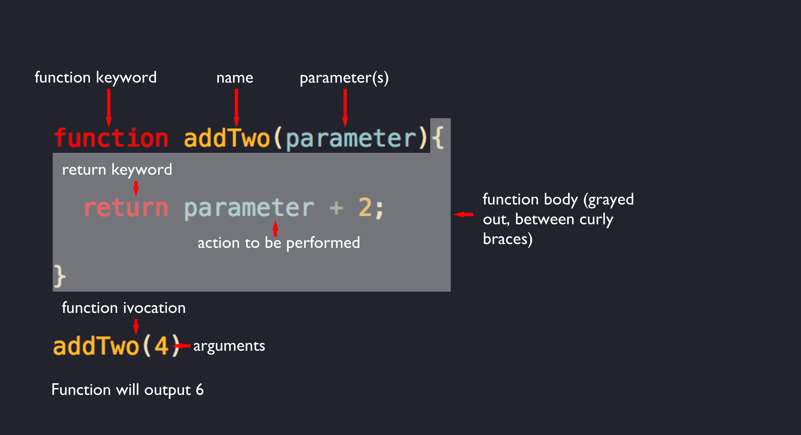
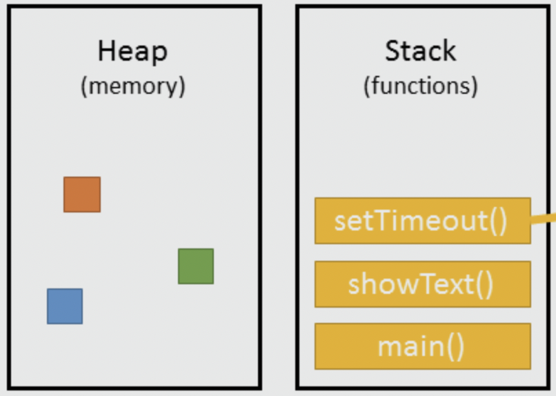
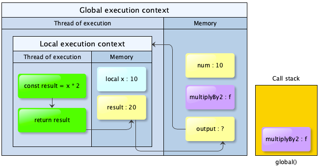
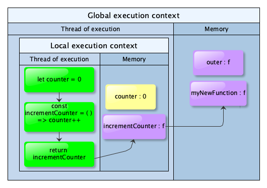
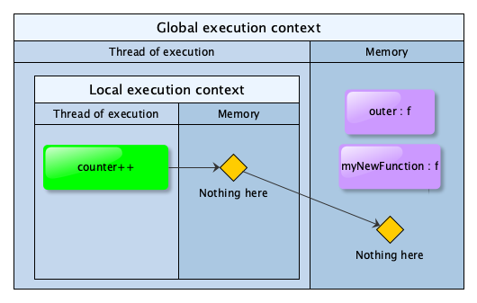
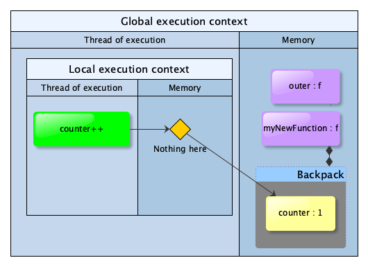
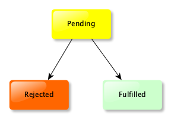

<a href="https://revealjs.com">
        
</a>

### JS - Behind the scenes

[@vipinajayakumar](https://twitter.com/vipinajayakumar)

---

## Let's learn about

- Basics facts of life 🏠
- Higher-order functions 🦸‍♀️
- Closure 🎄
- Asynchronous JavaScript 🤹
- Promise 🤝
- Async await 🚦

---

## Heavily inspired by

- [JavaScript: The Hard Parts, v2](https://frontendmasters.com/courses/javascript-hard-parts-v2/)
- [JavaScript: The Advanced Concepts](https://www.udemy.com/course/advanced-javascript-concepts)

---

## Basic facts of life 🏠

--

Single thread of execution

Note:

- Line by line execution

--



[Frontamentals - JavaScript Functions](https://www.frontamentals.com/functions/)

<!-- .element: class="caption" -->

--

## JS engine

- JavaScript engine is a program that executes JS code.
- e.g. [V8](https://v8.dev/) by Google

 <!-- .element: width="40%" -->

[JavaScript Call Stack, Event Loop and Callbacks](https://prashantb.me/javascript-call-stack-event-loop-and-callbacks/)

<!-- .element: class="caption" -->

--


Reference:
[In-Depth Introduction to Call Stack in JavaScript](https://medium.com/swlh/in-depth-introduction-to-call-stack-in-javascript-a07b8513bcc3)

<!-- .element: class="caption" -->

--

```js []
const num = 10

const multiplyBy2 = (x) => {
 const result = x * 2
 return result
}

const output = multiplyBy2(num)
```

--

```js []
const num = 10

const multiplyBy2 = (x) => {
 const result = x * 2
 return result
}

const output = multiplyBy2(num)
```



---

## Higher-order functions 🦸‍♀️

- Take callback functions as arguments or
- Return a function as output.

--

```js []
let numbers = [1, 4, 9]
let roots = numbers.map((num) => Math.sqrt(num))

// roots is now     [1, 2, 3]
// numbers is still [1, 4, 9]
```

--

## Functions are first-class citizens in JS

Note:

- Treated just like any other object.
- Therefore, it's possible to pass them in as parameters or return them from a
  function as well.

--


Note:

- Functions were already cool even before they could take parameters
- I remember learning to call them `procedures`
- They help with DRY.
- Parameters lets us take DRY one step further.
- With HOF, functions are now extremely powerful!

---

## Closure 🎄


Note:

- Notice the backpack that the function is carrying.

--

```js []
const outer = () => {
 let counter = 0
 const incrementCounter = () => counter++
 return incrementCounter
}

const myNewFunction = outer()
myNewFunction()
```

--

```js [7]
const outer = () => {
 let counter = 0
 const incrementCounter = () => counter++
 return incrementCounter
}

const myNewFunction = outer()
myNewFunction()
```



--

```js [8]
const outer = () => {
 let counter = 0
 const incrementCounter = () => counter++
 return incrementCounter
}

const myNewFunction = outer()
myNewFunction()
```



--

## Can functions remember stuff?

--

- When a function is created, it maintains a link to its lexical environment
- Scoping: How a parser resolves variable names when functions are nested
  - Lexical scoping: Based on where function is defined
  - Dynamic scoping: Based on where function is executed

--

```js [8]
const outer = () => {
 let counter = 0
 const incrementCounter = () => counter++
 return incrementCounter
}

const myNewFunction = outer()
myNewFunction()
```



Note:

- Show closure in browser

--

> A closure is the combination of a function bundled together (enclosed) with
> references to its surrounding state (the lexical environment). In other words,
> a closure gives you access to an outer function’s scope from an inner
> function. In JavaScript, closures are created every time a function is
> created, at function creation time.

[Mozilla definition for closure](https://developer.mozilla.org/en-US/docs/Web/JavaScript/Closures)

--

```js [11-12]
const outer = () => {
 let counter = 0
 const incrementCounter = () => counter++
 return incrementCounter
}

const myNewFunction = outer()
myNewFunction() // counter = 1
myNewFunction() // counter = 2

const myNewestFunction = outer()
myNewestFunction() // counter = ?
```

--

> With great power comes great responsibility - Uncle Ben

--

## Usage of closures

- [once](https://underscorejs.org/#once),
  [memoize](https://underscorejs.org/#memoize)
- [Iterators and generators](https://developer.mozilla.org/en-US/docs/Web/JavaScript/Guide/Iterators_and_Generators)
- Data hiding and encapsulation - used in
  [JavaScript Module Pattern](https://coryrylan.com/blog/javascript-module-pattern-basics)
- Asynchronous JavaScript - callbacks and promises rely on closure to persist
  state

Note:

- once - ensure a function once runs once, e.g., an initialisation
- memoize - memo: short note on something to be remembered and is linked to
  memory; a memoize function improves performance by caching results for
  previous invocations,
- Iterators provide `next` method so that you can retrieve things from a
  collection. [Example](https://masteringjs.io/tutorials/fundamentals/iterator).
- Generators use the `yield` keyword to pause execution.
  [Example](https://developer.mozilla.org/en-US/docs/Web/JavaScript/Reference/Global_Objects/Generator).

--

  <!-- .slide: data-background-color="white" data-background-iframe=" https://quiz.typeofnan.dev/lexical-scope/" data-background-interactive -->

---

## Asynchronous JavaScript 🤹


Note:

- Asynchronous: 1 person multi-tasking even though they can only do 1 thing a
  time (like an oncall)
- Parallel: Multiple people doing things at the same time (like devs in a
  sprint)
- How can a single threaded JS engine multi-task? All it has is a call stack and
  memory heap.
- e.g. it comes across a Twitter API call. It has to wait there, right? If it
  goes past immediately after making the call, there's no way for it to come
  back and get the results.
- Hmmmm

--

## Blocking code can ruin the UX

Note:

- Browser uses a single thread to run all the JavaScript in your page as well as
  to perform layout, reflows, and garbage collection. This means that
  long-running JavaScript functions can block the thread, leading to an
  unresponsive page and a bad user experience.
- Well, it turns out that JS is not alone.
- It's just one musician that's part of a bigger orchestra.

--


[The Javascript Runtime Environment](https://olinations.medium.com/the-javascript-runtime-environment-d58fa2e60dd0)

<!-- .element: class="caption" -->

Note:

- The Web APIs can be seen on the `window` object in the console.
- The Event Loop has the least glamourous job — to monitor the Call Stack and
  the Callback Queue. If the Call Stack is empty, it will take the first event
  from the queue and will push it to the Call Stack, which effectively runs it.

--

  <!-- .slide: data-background-color="white" data-background-iframe=" http://latentflip.com/loupe" data-background-interactive -->

Note:

- If we change the timer to 0s, would the execution order be different?

--

## What if we want to track the background task in JS land?

---

## Promise 🤝

Introduced in ES6 2015


--

```js []
fetch('https://example.com/movies.json')
 .then((response) => response.json())
 .then((data) => console.log(data))
```

--

```js []
const myPromise = new Promise(function (resolve, reject) {})
myPromise.then(onFulfilledFunc).catch(onRejectedFunc)

// {
//   [[PromiseState]]: "pending",
//   [[PromiseResult]]: undefined
// }
```



Note:

- The double brackets indicate that these are properties used internally by JS
  engine. You can't access the state or result directly, only via Promise
  methods.
- `catch` lets you do error handling.
- You can chain lots of `then` and `catch` statements.

--

## Benefits

- More readable
- Easy to chain; avoid callback pyramid of doom
- Better error handling
- Promise.all

--

```js []
setTimeout(() => console.log('Hello'), 0)

fetch('https://example.com/movies.json') //
 .then((data) => console.log(data))

blockfor300ms()

console.log('Bye')
```

Note:

- How could we block for 300ms?

```js []
var i = 0
while (i < 1000000000) {
 i++
}
```

--

```js []
setTimeout(() => console.log('Hello'), 0)

fetch('https://example.com/movies.json') //
 .then((data) => console.log(data))

blockfor300ms()

console.log('Bye')

// Bye
// movies
// Hello
```

--

onCompletion/onRejection tasks go to the Microtask queue (or Job queue) which
the event loop prioritises over callback queue

---

## Async await 🚦

Introduced in ES8 2017

--

```js []
function hello() {
 return 'Hello'
}
hello()
```

--

```js []
async function hello() {
 return 'Hello'
}
hello()

hello().then(alert)
```

--

## Async function returns a promise

--

```js []
async function hello() {
 const greeting = await Promise.resolve('Hello')
 return greeting
}

hello().then(alert)
```

Note:

- When you Promise.resolve on a string. It converts it into a promise first and
  then resolves it with the string as the return value.

--

## Await pauses your code until Promise is fulfilled and then returns the resulting value

Note:

- How does it pause? Remember that generators can pause execution?
- Closure

--

## Benefits of async/await

- Syncactic sugar
- Makes it look like synchronous code?
- Easier to read?
- Can await Promise.all

Note:

- Even though it looks like synchronous code, remember that the whole async
  funtion is non-blocking
- Beginners might not understand how async await code truly works.
- Another downside: Can only use await within async function.

--

  <!-- .slide: data-background-color="white" data-background-iframe=" https://quiz.typeofnan.dev/async-await/" data-background-interactive -->

--

Further reading: [Making asynchronous programming easier with async and await](https://developer.mozilla.org/en-US/docs/Learn/JavaScript/Asynchronous/Async_await)

---

## Conclusion

- Basics facts of life 🏠
- Higher-order functions 🦸‍♀️
- Closure 🎄
- Asynchronous JavaScript 🤹
- Promise 🤝
- Async await 🚦
